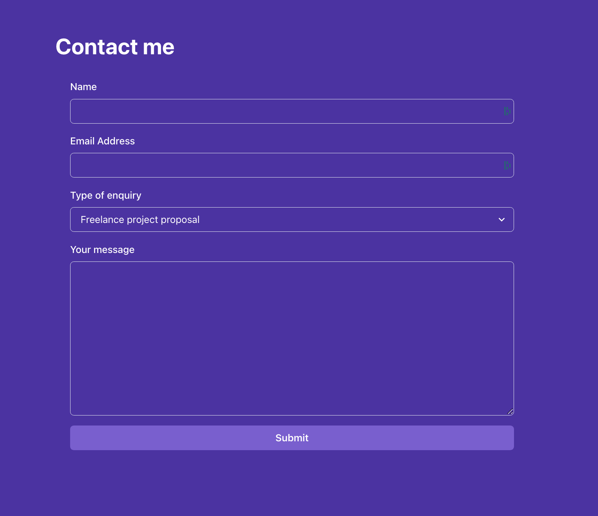

# PROJETO
Este foi um projeto feito seguindos os princípios e fundamentos ensinados pelo curso **FRONT END DEVELOPER**, através da instituição **META**.

### Objetivo
Criar um _Portifólio_ que funcionasse através de uma Landing Page, utilizando o framework `React`, bem como algumas de suas bibliotecas 

## Conhecimentos Utilizados
Neste projeto, foram utilizados os seguintes conhecimentos:
 * `React` (Para todo o Layout da Pagina)

#### Bibliotecas de React Utilizadas
* **Chakra UI -** Usada para facilitar a criação do Layout
* **Formik -** Usado para criar um melhor controle de formulário
* **Yup -** Usado juntamente com o Formik para criar melhorar a criação do formulário 

# Seções
### Navbar + Primeira Pagina 

### Mostra de Projetos Pessoais

### Formulário

### Validação do Formulário

### Mensagem de Erro

### Mensagem de Submit

### Navbar Dinâmico

